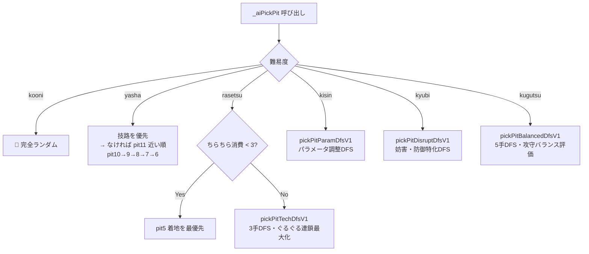
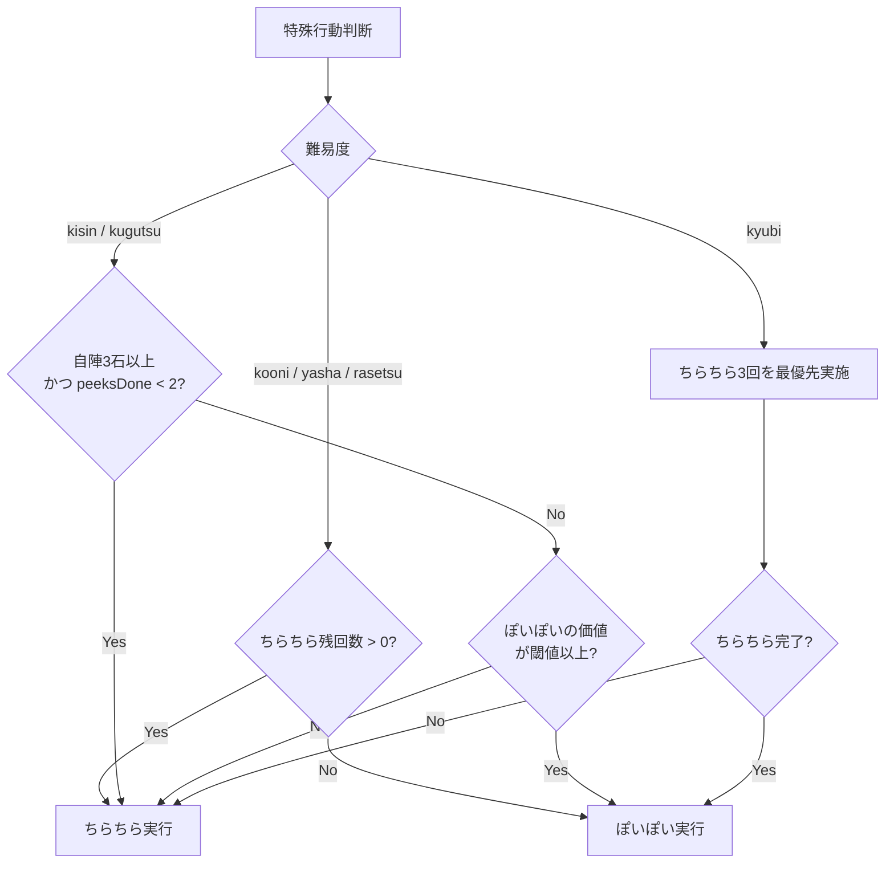

# ManColor 統合ガイド

> AI能力一覧・やることリスト・デプロイ手順・動作確認手順をまとめたシート

---

# 目次

1. [AI能力一覧](#1-ai能力一覧)
2. [やることリスト](#2-やることリスト)
3. [デプロイ手順](#3-デプロイ手順)
4. [PC+スマホ動作確認](#4-pcスマホ動作確認)

---

---

# 1. AI能力一覧

最終更新: 2026-04-27

---

## 1-1. AIロジック関数一覧

#### 路選択

- `pickPitBalancedDfsV1` — 5手DFS・攻守バランス型 → **kugutsu（傀儡）**
- `pickPitParamDfsV1` — パラメータ調整版 → **kisin（鬼神）**
- `pickPitTechDfsV1` — 技特化3手DFS → **rasetsu（羅刹）**
- `pickPitDisruptDfsV1` — 妨害・防御特化DFS → **kyubi（九尾）**

#### ざくざく配置・撒き順

- `decidePlacementsFortuneV1` — 占い情報活用の最適配置 → **rasetsu・kisin・kyubi・kugutsu共通**
- `optimizeSowOrderFortuneV1` — 撒き前の石並び替え → **同上**

#### SimAI専用

- `decidePlacementsBasicV1` — 簡易配置 → **シミュ用**
- `decideSpecialActionV1` — ちらちら vs ぽいぽい → **kisin・kugutsu（SimAI）**
- `createMemoV1` / `updateMemoV1` — 占い色推測メモ → **全難易度**

> シミュレーション路選択: `pickPitParamDfsV1`（GameAI.js）+ `DEFAULT_KISIN_PARAMS`

---

## 1-2. 路選択フローチャート



---

## 1-3. DFS 統合評価スコア（kisin・kugutsu共通）

全路にスコア計算 → 最高点の路を選択

```
┌─ 攻撃 ──────────────────────────────────────────────────────┐
│ ぐるぐる      pit11着地 → 連鎖数²×乗数 + 2色以下で加点       │
│ ざくざく      自路空き着地 + 対面石数比例 + 知識色ボーナス    │
│ ちらちら準備  pit5着地の価値（1〜3回目・序盤/中盤で閾値変化） │
│ 2手先読み    撒き後プレイヤー最善応手後のAI有利ボーナス       │
└─────────────────────────────────────────────────────────────┘
┌─ 防御 ──────────────────────────────────────────────────────┐
│ 脅威成長      相手の攻撃機会増加に減点                        │
│ ざくざく防御  自路・対面に石が多いと非線形ペナルティ          │
│ 被ざくざく防止 撒き後に自路が多く相手対面が空だと大ペナルティ │
│ ちらちら被弾防止 相手pit11着地穴が増えたらペナルティ          │
│ くたくた妨害  相手がくたくた発動可能なら石送りペナルティ      │
└─────────────────────────────────────────────────────────────┘
┌─ 色評価 ────────────────────────────────────────────────────┐
│ pit11着地色  推測相手占い色 > 自占い色 > 確認プラス石         │
│ 路品質評価   路全体の高価値色が多いと加点 / マイナス確定で減点 │
│ 自路着地価値  自路に落ちる石の色価値で加減点                  │
│ 相手賽壇防止  高価値石が pit5 に流れる手を大減点              │
└─────────────────────────────────────────────────────────────┘
┌─ 調整 ──────────────────────────────────────────────────────┐
│ 気分システム   占い重視度を ×0.3〜1.7 でランダムにゆらす     │
│ 防御TB        攻撃スコア差が閾値以内の手のみ防御スコアも加味  │
└─────────────────────────────────────────────────────────────┘
```

---

## 1-4. kisin vs kugutsu パラメータ比較

```
ぐるぐるBase（中盤）
  kisin   ████████████░░░░░░░░   77
  kugutsu ████████████████████  134  ×1.7

ぐるぐる連鎖乗数
  kisin   ██████████░░░░░░░░░░   36
  kugutsu ████████████████████   70  ×1.9

ぐるぐる2手先読み乗数
  kisin   █████████░░░░░░░░░░░  1.73
  kugutsu ████████████████████   3.5  ×2.0

ぐるぐる破壊ボーナス
  kisin   ████████████░░░░░░░░   33
  kugutsu ████████████████████   55  ×1.7

脅威成長ペナルティ乗数
  kisin   ████████░░░░░░░░░░░░  1.2
  kugutsu ████████████████████  3.0  ×2.5

2手先読み・AI側乗数
  kisin   ███████░░░░░░░░░░░░░  0.35
  kugutsu ████████████████████  1.11  ×3.2

2手先読み・敵脅威乗数
  kisin   █████░░░░░░░░░░░░░░░  0.55
  kugutsu ████████████████████   2.0  ×3.6

ちらちら閾値1回目（低いほどぐるぐる優先）
  kisin   ████████████████████   37
  kugutsu ████░░░░░░░░░░░░░░░░    6  ×0.2

midInferred（相手占い色の価値）
  kisin   ███████████░░░░░░░░░   34
  kugutsu ████████████████████   62  ×1.8

midUnknownPenalty（未確定石）
  kisin   ██ (ペナルティ)          −4
  kugutsu ████ (ボーナス)         +10  ← kugutsuは未確定を好む
```

---

## 1-5. 各システムの難易度別フロー

### 撒き順最適化（`optimizeSowOrderFortuneV1`）

```
✗ なし  →  kooni / yasha
○ あり  →  rasetsu / kisin / kyubi / kugutsu
            └ 高価値石 → pit11（AI賽壇）
            └ 低価値石 → pit5（相手賽壇）
            └ 優先順: 推測相手占い色 > 自占い色 > 確認プラス色 > 確定マイナス（絶対入れない）
```

### ざくざく後の石配置（`decidePlacementsFortuneV1`）

```
ランダム      kooni
占い色優先    yasha    → 自占い色ならぐるぐるセットアップ路へ / それ以外は非空路ランダム
リスク回避    rasetsu  → ぐるぐるセットアップ路優先 + 被ざくざくリスクの低い路をさらに優先
スコア最適    kisin / kyubi / kugutsu
              → 知識色込みスコアで全路評価し最適配置
```

### ちらちら / ぽいぽい判断



> **ぽいぽい閾値（kisin）：** ちらちら残≥2 → 25 / 残1 → 6 / 推測色が相手賽壇に有 → +22 / 石2個以上 → +4

### ぽいぽい石の選択優先順（全難易度共通）

```
1位  AI自身の占い色（相手にとって +5点 の石）
2位  推測プレイヤー占い色（+3点を奪う）
3位  AIが確認済みの中央プラス石（+1を奪う）
4位  プレイヤーが確認済みの中央プラス石
✗   確定マイナス石は絶対に除去しない（取ると相手のマイナスが消える）
⚠   自賽壇に確定マイナス石がある場合は状況次第で自賽壇を捨てる
```

### くたくた発動条件

```
標準（AI賽壇 ≥ 相手賽壇）       →  kooni / yasha / rasetsu / kugutsu
条件付き（AI賽壇 ≥ 相手賽壇 × 2）→  kisin のみ  ← AI石が相手の2倍以上で発動
```

### 予測フェーズ（ゲーム終了後の占い色当て）

```
ランダム5色  →  kooni
推測色使用   →  yasha / rasetsu / kisin / kyubi / kugutsu
              └ _aiMemo.inferredPlayerColor を優先
              └ なければプレイヤー賽壇の最多色
```

---

## 1-6. memoシステム（プレイヤー占い色の推測）

全難易度共通でターン開始時に更新。

```
観察ソース:
  ・プレイヤー路（pit0〜4）の石   ×1 ウェイト
  ・プレイヤー賽壇（pit5）の石    ×3 ウェイト
  ・AIが確認済みの中央石は除外（個人占い色ではないため）

出力:
  inferredPlayerColor  累積頻度 最多 → 推測プレイヤー占い色
  playerAvoidedColor   累積頻度 最少（3色以上データあり）→ 推定マイナス色
```

---

## 1-7. 難易度プロファイル

```
┌─────────────────────────────────────────────────────────────┐
│ 🟢 kooni（小鬼）                                             │
│  路選択: ランダム                                             │
│  撒き順: ✗   配置: ランダム   ちらちら: 消費優先             │
│  くたくた: 標準   予測: ランダム5色                           │
└─────────────────────────────────────────────────────────────┘
┌─────────────────────────────────────────────────────────────┐
│ 🔵 yasha（夜叉）                                             │
│  路選択: 技路優先 → pit11近い順                               │
│  撒き順: ✗   配置: 占い色優先   ちらちら: 消費優先            │
│  くたくた: 標準   予測: 推測色                                │
└─────────────────────────────────────────────────────────────┘
┌─────────────────────────────────────────────────────────────┐
│ 🔴 rasetsu（羅刹）                                           │
│  路選択: ちらちら前 → pit5最優先 / 後 → 3手DFS               │
│  撒き順: ○   配置: ぐるぐる優先 + 被ざくざくリスク回避        │
│  ちらちら: 消費優先   くたくた: 標準   予測: 推測色           │
└─────────────────────────────────────────────────────────────┘
┌─────────────────────────────────────────────────────────────┐
│ 🟣 kisin（鬼神）                               パラメータDFS型 │
│  路選択: パラメータ調整DFS（pickPitParamDfsV1）                │
│  撒き順: ○   配置: スコア最適   ちらちら: 価値比較            │
│  くたくた: 条件付き（AI賽壇 ≥ 相手賽壇 × 2）   予測: 推測色  │
│  色読みなし（武力型）/ 気分システム                            │
└─────────────────────────────────────────────────────────────┘
┌─────────────────────────────────────────────────────────────┐
│ 🟡 kyubi（九尾）                               妨害・ちらちら型│
│  路選択: 妨害・防御特化DFS（pickPitDisruptDfsV1）             │
│  ざくざく超高評価 / 相手ぐるぐる破壊ボーナス                  │
│  撒き順: ○   配置: スコア最適   ちらちら: 全3回最優先         │
│  くたくた: 標準   予測: 推測色                                │
└─────────────────────────────────────────────────────────────┘
┌─────────────────────────────────────────────────────────────┐
│ ⚫ kugutsu（傀儡）                             攻守バランス型  │
│  路選択: 5手DFS・攻守バランス（pickPitBalancedDfsV1）          │
│  kugutsu / kisin比: ぐるぐる ×1.7〜2.0 / 脅威ペナルティ ×2.5 │
│  撒き順: ○   配置: スコア最適   ちらちら: 価値比較            │
│  くたくた: 標準   予測: 推測色                                │
│  気分システム                                                  │
└─────────────────────────────────────────────────────────────┘
```

---

---

# 2. やることリスト

---

## 2-1. 直近の動作確認

- [ ] 2端末で同時アクセスできる
- [ ] ルーム作成→参加→対局開始が通る
- [ ] 1試合完了後、再戦が成立して次の試合に入れる
- [ ] 再戦後に背景色/先手/盤面初期化が正しい

## 2-2. 公開前にやること

- [ ] 友達テスト（2-4人）で接続安定性確認
- [ ] 主要画面の文言と操作フロー最終確認
- [ ] バックアップ作成（zip）← v0.9済み、v1.0時にまた作成
- [ ] Ver番号更新（Ver1.0になったら実施）

## 2-3. メモ（運用方針）

- 無料枠はスリープがあるため、初回接続が遅いことがある
- 本番運用に移る時は有料プランを検討

## 2-4. 今後の機能追加

- [x] 切断すると再接続できない例がある。同じルームならルーム参加を押すことで戻れるようにしたい
- [ ] サーバー側じゃない方がざくざく中によく落ちる（遅延追加・ログ追加済み、2端末実機確認が必要）

## 2-5. ゲーム性に関するメモ（検討中）

- ゲーム性として、後手は相手と同じ色を入れれば、マイナスになることがない。→強い？（解決方法未検討）

## 2-6. 黄金石システム（将来機能）

- [ ] **黄金石**をゲーム内通貨として導入する
- [ ] 獲得方法：
  - ソロ（AI対戦）に勝つと黄金石を獲得
  - ランダム対戦でBETして勝つと相手の黄金石を総取り
- [ ] ランダム対戦：黄金石をBETして参加（負けたら相手に全額渡す）
- [ ] 友達と遊ぶ：黄金石BETなし（フリー対戦）
- [ ] **ショップ機能**：黄金石でコスメ系アイテムと交換
  - 背景・アイコンなどゲームプレイに影響しないコンテンツのみ
- [ ] 強いプレイヤーほど黄金石が増える仕組み（実力反映型）

---

---

# 3. デプロイ手順

---

## 3-1. URL 早見表

| 用途                           | URL                                        |
| ------------------------------ | ------------------------------------------ |
| **フロントエンド（遊ぶ場所）** | https://mancolor-static-site.onrender.com/ |
| **サーバー（疎通確認）**       | https://mancolor.onrender.com              |
| **GitHub リポジトリ**          | https://github.com/Ryona272/ManColor       |

---

## 3-2. アップデート手順（毎回これだけ）

```
npm.cmd run build
git add .
git commit -m "update: 変更内容の説明"
git push origin main
```

その後 [Render ダッシュボード](https://dashboard.render.com/) を開く：

- **Static Site** → Manual Deploy → **Deploy latest commit**
- **Web Service** → Manual Deploy → **Deploy latest commit**（サーバー側を変更した場合のみ）

---

## 3-3. 初回のみ（PCを変えたとき・.gitフォルダが消えたとき）

```
git init
git remote add origin https://github.com/Ryona272/ManColor.git
git branch -M main
```

その後アップデート手順の `git push` を初回だけ以下に変える：

```
git push origin main --force
```

---

## 3-4. Render 設定の固定チェック

| 項目                          | 値                        |
| ----------------------------- | ------------------------- |
| Web Service Start Command     | `npm run room:server`     |
| Static Site Build Command     | `npm ci && npm run build` |
| Static Site Publish Directory | `dist`                    |
| `VITE_ROOM_SERVER_HOST`       | `mancolor.onrender.com`   |
| `VITE_ROOM_SERVER_PORT`       | `443`                     |

---

## 3-5. 障害時の切り分け

1. `https://mancolor.onrender.com` を開いて `ok` が返るか確認
2. Static Site の環境変数に `https://` を入れていないか確認
3. Web Service ログに起動エラーが出ていないか確認
4. 解消しない場合は `Clear build cache & deploy` を実行

---

## 3-6. git 一発コマンド（PowerShell）

```
cmd /c "cd /d C:\Users\User\OneDrive\Desktop\ManColor && npm run build && git add -A && git commit -m "update" && git push"
```

---

---

# 4. PC+スマホ動作確認

---

## 4-1. ターミナルコマンド（View → Terminal）

```sh
# ディレクトリの移動
cd "C:\Users\User\OneDrive\Desktop\ManColor"

# 依存インストール
npm.cmd install

# サーバー起動（LAN: 同じWiFi下でデバッグ可）
npm.cmd run room:server:lan

# サーバー自動再起動（開発）
npm.cmd run romm:server:dev

# フロント起動
npm.cmd run dev

# フロントとサーバー同時起動
npm.cmd run dev:all

# Docker ビルドと実行
npm.cmd run docker:build
npm.cmd run docker:run

# Google Play Console用
npm.cmd run release:bundle
```
